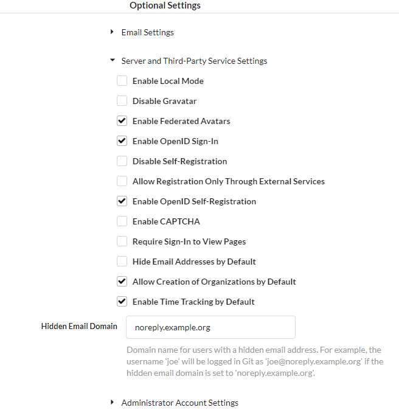

# Gitea - CentOS

Tested and installed on `CentOS 7.6-1810`.

## Prerequisites

### Repositories

Two third-party repositories are used since CentOS `base` and `epel` contain very outdated versions of PostgreSQL and Redis.

The first is the [Inline with Upsteam Stable (IUS) Community Project](https://ius.io/) repository. This install will be using this repository for an updated version of [Git](https://git-scm.com/) and [Redis](https://redis.io/).

The second is the official repository for [PostgreSQL 11](https://www.postgresql.org/).

```shell
sudo yum install -y \
https://centos7.iuscommunity.org/ius-release.rpm \
https://download.postgresql.org/pub/repos/yum/11/redhat/rhel-7-x86_64/pgdg-centos11-11-2.noarch.rpm
```

### Packages

The following packages are required. `git2u` and `redis40u` are from the IUS repository and named as such to prevent collisions with CentOS standard repositories.

```shell
sudo yum install -y \
git2u \
redis40u \
postgresql11
```

If this installation's database will be local, include the PostgreSQL server:

```shell
sudo yum install -y postgresql11-server
```

If any data directories (repositories, database, Gitea custom, LFS, etc.) will be mounted over NFS, install the NFS utilities:

```shell
sudo yum install -y nfs-utils
```

## PostgreSQL

### Database over NFS

Create the directory that the NFS export will mount to:

```shell
sudo mkdir -p /opt/psql/data
```

Mount the NFS export:

```shell
sudo mount -t nfs <NAS IP>:/gitea/database /opt/psql/data
```

Open `/etc/fstab` for editing and add the following line:

```shell
<NAS IP>:/gitea/database /opt/psql/data  nfs defaults,_netdev    0 0
```

!!! Note
    The `_netdev` flag denotes that mounting should be performed after networking has been initialized.

Installing PostgreSQL should have created a `postgres` user and `postgres` group. Set ownership of the new directories to that user and group.

```shell
sudo chmod -R 700 /opt/psql
```

```shell
sudo chown -R postgres:postgres /opt/psql
```

Edit the PostgreSQL `systemd` service to set the new database directory:

```shell
sudo systemctl edit postgresql-11
```

This will create and override file. Insert the following:

```shell
[Service]
Environment=PGDATA=/opt/psql/data

[Unit]
RequiresMountsFor=/opt/psql/data
```

### Setup Database

Initialize the database:

```shell
sudo /usr/pgsql-11/bin/postgresql-11-setup initdb
```

Open `pg_hba.conf` for editing.

!!! Note "Local Storage"
    `/var/lib/pgsql/11/data/pg_hba.conf`

!!! Note "NFS Storage"
    `/opt/psql/data/pg_hba.conf`

Edit the following lines to change the authentication method from `ident` to `md5`:

```diff
   # TYPE   DATABASE        USER            ADDRESS             METHOD
   # IPv4 connections:
-- host     all             all             127.0.0.1/32        ident
++ host     all             all             127.0.0.1/32        md5
   # IPv6 connections:
-- host     all             all             ::1/128             ident
++ host     all             all             ::1/128             md5
```

Enable service autostart and start PostgreSQL:

```shell
sudo systemctl enable --now postgresql-11
```

Open the PostgreSQL terminal as the `postgre` user:

```shell
sudo -u postgres psql
```

Create the `gitea` database user:

```shell
CREATE USER gitea WITH PASSWORD '1qazxsw2';
```

!!! Warning
    It should go without saying, but do not use the provided example password.

Create the `gitea` database and set the owner to the newly created user:

```shell
CREATE DATABASE gitea OWNER gitea;
```

Grant all privileges on the new database to the new user:

```shell
GRANT ALL PRIVILEGES ON DATABASE gitea TO gitea;
```

Exit the PostgreSQL terminal:

```shell
exit;
```

## Redis

Open `/etc/redis.conf` for editing and change the following values:

```diff
-- daemonize no
++ daemonize yes

-- supervised no
++ supervised systemd

-- appendonly no
++ appendonly yes
```

Open `/etc/sysctl.conf` for editing and add the following line:

```shell
vm.overcommit_memory = 1
```

!!! Note
    This is a system tune-able for Redis to prevent forking errors resulting from duplicate data consuming all of the allocated memory.

Generate a new `initramfs` with the new tune-able:

```shell
sudo dracut -v -f
```

Enable `redis` autostart and start the service:

```shell
sudo systemctl enable --now redis
```

## Gitea

### NFS

Three different exports should be used to store Gitea data. The following structure is used to mimic the default directory structure and minimize the number of customizations in the setup.

- `custom` - Configuration file and customizations
- `data` - The `lfs` directory, which stores Git Large File Storage objects
- `gitea-repositories` - All repositories

Create the directories:

```shell
sudo mkdir -p /opt/gitea/{custom,data,gitea-repositories}
```

Create the directory for LFS:

```shell
sudo mkdir /opt/gitea/data/lfs
```

Mount the NFS exports:

```shell
sudo mount -t nfs <NAS IP>:/gitea/custom /opt/gitea/custom
```

```shell
sudo mount -t nfs <NAS IP>:/gitea/gitea-repositories /opt/gitea/gitea-repositories
```

```shell
sudo mount -t nfs <NAS IP>:/gitea/data_lfs /opt/gitea/data/lfs
```

Open `/etc/fstab` for editing and add the following line:

```shell
<NAS IP>:/gitea/custom              /opt/gitea/custom               nfs defaults,_netdev    0 0
<NAS IP>:/gitea/gitea-repositories  /opt/gitea/gitea-repositories   nfs defaults,_netdev    0 0
<NAS IP>:/gitea/data_lfs            /opt/gitea/data/lfs             nfs defaults,_netdev    0 0
```

### Application

If NFS is not used and the application directory does not exist, create it:

```shell
sudo mkdir -p /opt/gitea
```

Create a user and group for Gitea

!!! Note
    A `home` directory should be used to store SSH keys for the application.

```shell
sudo adduser -rm -s /bin/bash gitea
```

Set the owner and permissions for the application directory.

```shell
sudo chmod -R 700 /opt/gitea
```

```shell
sudo chown -R gitea:gitea /opt/gitea
```

Get the link for the most recent version of Gitea [here](https://dl.gitea.io/gitea/).

!!! Note
    Choose the most recent tagged version instead of Master.

Choose `gitea-<version>-linux-amd64`. Version `1.6.1` was used and tested here.

Download the application as the `gitea` user to the file `gitea`:

```shell
sudo -u gitea curl https://dl.gitea.io/gitea/1.6.1/gitea-1.6.1-linux-amd64 -o /opt/gitea/gitea
```

Make the dowloaded application executable:

```shell
sudo chmod +x /opt/gitea/gitea
```

Open the port desired to run the application on. The tested install used standard HTTP ports and requires permissions to listen on ports less than 1000.

```shell
sudo firewall-cmd --permanent --zone=public --add-port=80/tcp
```

!!! Note
    Keep port `80` open if HTTP -> HTTPS redirection will be used.

If HTTPS will be used, remember to open `443` as well.

```shell
sudo firewall-cmd --permanent --zone=public --add-port=443/tcp
```

Reload the firewall:

```shell
sudo firewall-cmd --reload
```

Allow the Gitea application to listen on ports less than 1000:

```shell
sudo setcap 'cap_net_bind_service=+ep' /opt/gitea/gitea
```

Create and open a `systemd` service file:

```shell
sudo touch /etc/systemd/system/gitea.service
```

```shell
[Unit]
Description=Gitea (Git with a cup of tea)
After=syslog.target
After=network.target
After=postgresql.service
After=redis.service

[Service]
RestartSec=2s
Type=simple
User=gitea
Group=gitea
WorkingDirectory=/opt/gitea/
ExecStart=/opt/gitea/gitea web --port 80
Restart=always
CapabilityBoundingSet=CAP_NET_BIND_SERVICE
AmbientCapabilities=CAP_NET_BIND_SERVICE

[Install]
WantedBy=multi-user.target
```

!!! Note
    Ensure the desired port is reflected on the `ExecStart` line.

Enable autostart on the Gitea service and start it:

```shell
sudo systemctl enable --now gitea
```

Navigate to `http://<server IP>/install` to complete setup.

### Setup

Input the database connection information:


Set the general settings of the application. If NFS is used and the above instructions were followed, the default directory locations are used and do not need to be changed.


!!! Note
    If standard HTTP and HTTPS are used, the port can be removed from **Gitea Base URL** to show nice URLs.

!!! Note
    If HTTPS is used, set the listen port to `443`. Redirection can be setup later.



!!! Note
    **Enable Local Mode** serves JS and CSS from the server itself instead of using CDNs.


!!! Note
    If the **Administrator Account Settings** are not filled out here, the first account created will become the administrator. Its a good idea to go ahead and create this account now.

Once everything is filled out, click install and wait for the process to complete.

### Redis Setup

Open `/opt/gitea/custom/conf/app.ini` for editing. Delete any existing `[session]` settings.

```diff
-- [session]
-- PROVIDER          = data/session
```

Enter the following information to use Redis as cache and session storage:

```shell
[cache]
ADAPTER  = redis
INTERVAL = 60
HOST     = network=tcp,addr=:6379,db=0,pool_size=100,idle_timeout=180
ITEM_TTL = 16h

[session]
PROVIDER          = redis
PROVIDER_CONFIG   = network=tcp,addr=:6379,db=0,pool_size=100,idle_timeout=180
COOKIE_NAME       = gitea
COOKIE_SECURE     = false
ENABLE_SET_COOKIE = true
GC_INTERVAL_TIME  = 86400
SESSION_LIFE_TIME = 86400
```

Restart Gitea:

```shell
sudo systemctl restart gitea.service
```

### HTTPS Redirect

Open `/opt/gitea/custom/conf/app.ini` for editing.

Under the `[server]` section, enter the following:

```shell
REDIRECT_OTHER_PORT = true
PORT_TO_REDIRECT    = 80
```

`PORT_TO_REDIRECT` is the port to listen for HTTP requests then redirects to the port identified in `HTTP_PORT`, which should be `443` if using HTTPS.

## Conclusion

Gitea is now setup and ready for use.

Refer to the [Configuration Cheatsheet](https://docs.gitea.io/en-us/config-cheat-sheet/) for additional setup.