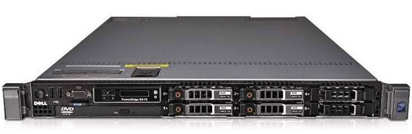

# Dell PowerEdge R610

## General Information

|                   |                           |
| :-                | :-                        |
| Form Factor       | 1U                        |
| Chipset           | Intel 5520                |
| CPU Socket        | 2x LGA 1366               |
| CPU Compatability | Xeon 5500 Xeon 5600    |
| RAM, Maximum      | 384 GB                    |
| RAM, Speed        | DDR3 800-1333             |
| RAM, Socket       | 12 (6/CPU)                |
| RAM, Channels     | 2                         |
| Storage           | 6x 2.5" SAS/SATA          |

## Parts & Part Numbers

| Part      | Dell Part #   |
| :-        | :-            |
| Chassis   | YPDP1         |

### System Boards

| Part                      | Dell Part #                   |
| :-                        | :-                            |
| Motherboard (Gen I)       | 3YWXK / 86HF8 / J352H / XDN97 |
| Motherboard (Gen II)      | F0XJ6 / TTXFN                 |
| 2.5" SAS/SATA Backplane   | D109N / KHP6H / WR7PP         |
| Center PCIe x8 Riser      | 4H3R8 / C480N                 |
| Left PCIe x8 Riser        | 6KMHT / X387M                 |

### Power Supplies / Batteries

| Part              | Dell Part #                                           |
| :-                | :-                                                    |
| 717w Power Supply | FJVYV / MP126 / RCXD0 / RN442                         |
| 502w Power Supply | 8V22F / C472K / DXWMN / J38MN / KY091 / MU791 / XTGFW |
| PERC Battery      | NU209 / U8735                                         |

### Cables

| Part                          | Dell Part #   |
| :-                            | :-            |
| Backplane Power               | XT567         |
| PERC 6/i Mini-SAS A           | NW348 / RF5PF |
| PERC 6/i Mini-SAS B           | FTTNX / JM257 |
| H200/H700 SAS A/B             | M246M / Y100N |
| DVD Drive Split SATA/Power    | RN657         |
| PERC 6i/H700 Battery          | RY631         |

### RAID Controllers

| Part              | Dell Part #                                           |
| :-                | :-                                                    |
| PREC H700 1GB     | HCR2Y                                                 |
| PERC H700 512MB   | CNXVV / 1THG8 / H2R6M / K883J / W56W0 / R374M / XXFVX |
| PERC H800 1GB     | 5KYFR / VVGYD                                         |
| PERC H800 512MB   | 71N7N / 87V49 / D90PG / N743J / NCHRW / R1HPD         |
| PERC 6/i          | H726F / DX481 / T954J / WY335                         |
| PERC 6/iR         | YK838 / JW063 / CR679                                 |
| PERC 5/E 256MB    | DM479 / GP297 / UT568 / XM768                         |

### Accessories

| Part                              | Dell Part #                                                                   |
| :-                                | :-                                                                            |
| Heatsink (< 130w)                 | TR995                                                                         |
| Heatsink (>= 130w)                | G1TJH                                                                         |
| RAM Blank/Filler                  | 52P2C                                                                         |
| DVD-ROM                           | MKT6V / FY190 / 4C94P / K145G / 46V56 / 7RDMR / 83M5C / FN679 / KVXM6 / P875G |
| DVD-RW                            | 0NT81 / 4V7F1 / 5WWRM / 95M6Y / 96R30 / HCHD9 / MC5V9 / U951M / 27NC0         |
| iDRAC 6 Express                   | JPMJ3 / DW592 / K9J8N / Y383M                                                 |
| iDRAC 6 Enterprise                | J675T / K869T / MU531 / R168K                                                 |
| System Fan (Sunon 40x56mm 15k)    | KVVP3                                                                         |
| System Fan Assembly               | WP838                                                                         |
| 2.5" Drive Tray/Caddy             | G176J                                                                         |
| 2.5" Drive Blank/Filler           | TW13J                                                                         |
| ReadyRails, Sliding               | P223J                                                                         |
| Cable Management Arm (CMA)        | NN006                                                                         |
| Bezel                             | TY293 / FU741                                                                 |

## Documents

- [R610 Specifications](docs/r610-specs.pdf)
- [R610 Technical Guide](docs/r610-tech-guide.pdf)
- [R610 Owners Manual](docs/r610-owners-manual.pdf)
